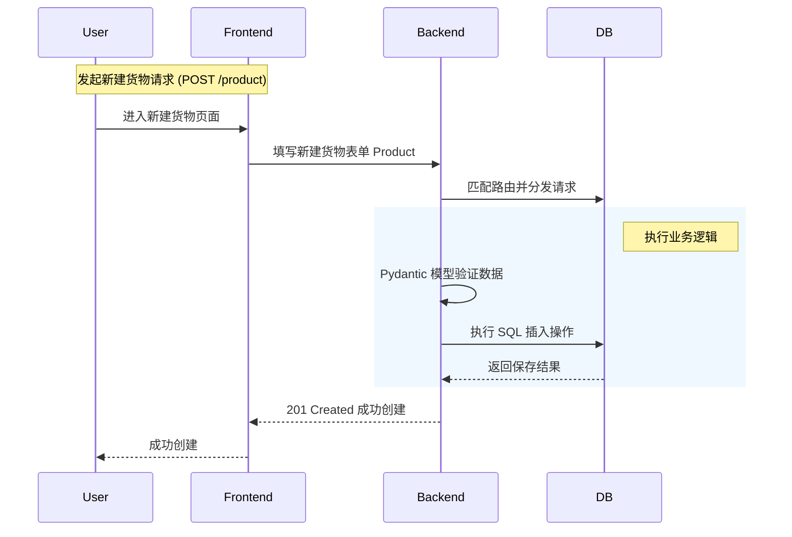
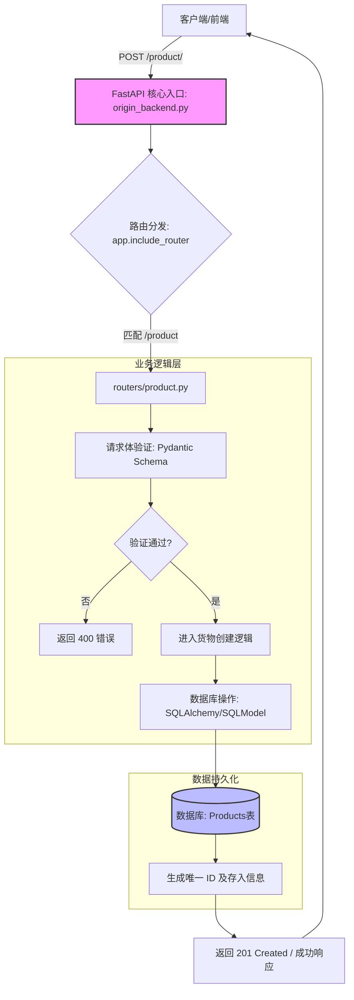
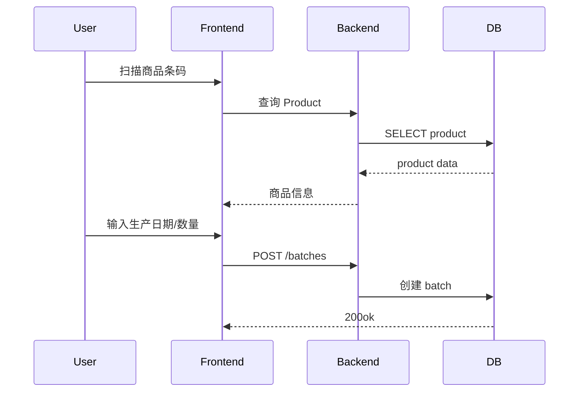
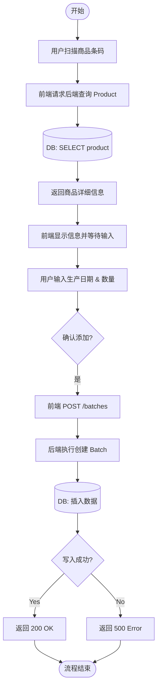

```mermaid
sequenceDiagram

participant User
participant Frontend
participant Backend
participant DB

Note over User, Frontend: 发起新建货物请求 (POST /product)

User->>Frontend: 进入新建货物页面
Frontend->>Backend: 填写新建货物表单 Product

Backend->>DB: 匹配路由并分发请求
    
    rect rgb(240, 248, 255)
        Note right of DB: 执行业务逻辑
        Backend->>Backend: Pydantic 模型验证数据
        Backend->>DB: 执行 SQL 插入操作
        DB-->>Backend: 返回保存结果
    end
    Backend-->>Frontend: 201 Created 成功创建
    Frontend-->>User: 成功创建
```

```mermaid
graph TD
    A[客户端/前端] -->|POST /product/| B[FastAPI 核心入口: origin_backend.py]
    B --> C{路由分发: app.include_router}
    C -->|匹配 /product| D[routers/product.py]
    
    subgraph 业务逻辑层
    D --> E[请求体验证: Pydantic Schema]
    E --> F{验证通过?}
    F -->|否| G[返回 400 错误]
    F -->|是| H[进入货物创建逻辑]
    H --> I[数据库操作: SQLAlchemy/SQLModel]
    end

    subgraph 数据持久化
    I --> J[(数据库: Products表)]
    J --> K[生成唯一 ID 及存入信息]
    end

    K --> L[返回 201 Created / 成功响应]
    L --> A

    style B fill:#f9f,stroke:#333,stroke-width:2px
    style J fill:#bbf,stroke:#333,stroke-width:2px
```

```mermaid
sequenceDiagram

participant User
participant Frontend
participant Backend
participant DB

User->>Frontend: 扫描商品条码
Frontend->>Backend: 查询 Product
Backend->>DB: SELECT product
DB-->>Backend: product data
Backend-->>Frontend: 商品信息

User->>Frontend: 输入生产日期/数量
Frontend->>Backend: POST /batches

Backend->>DB: 创建 batch
DB-->>Frontend: 200ok


```

```mermaid
graph TD
    %% 阶段 1: 查询
    Start([开始]) --> Scan[用户扫描商品条码]
    Scan --> ReqQuery[前端请求后端查询 Product]
    ReqQuery --> DBQuery[(DB: SELECT product)]
    
    DBQuery --> ResData[返回商品详细信息]
    ResData --> ShowInfo[前端显示信息并等待输入]

    %% 阶段 2: 提交
    ShowInfo --> Input[用户输入生产日期 & 数量]
    Input --> Confirm{确认添加?}
    Confirm -- 是 --> PostBatch[前端 POST /batches]
    
    %% 阶段 3: 后端处理与反馈
    PostBatch --> CreateBatch[后端执行创建 Batch]
    CreateBatch --> DBInsert[(DB: 插入数据)]
    
    DBInsert --> Success{写入成功?}
    Success -- Yes --> Ret200[返回 200 OK]
    Success -- No --> Ret500[返回 500 Error]
    
    Ret200 --> End([流程结束])
    Ret500 --> End
```